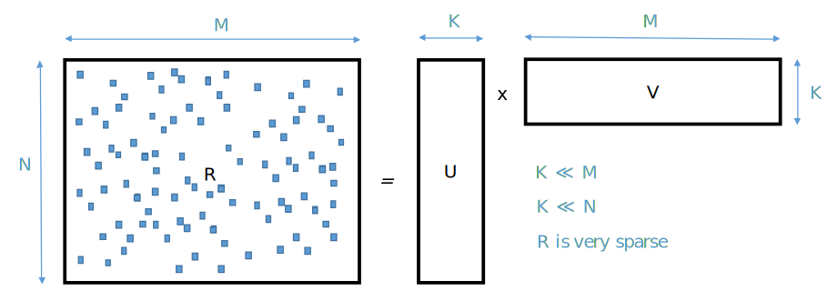

.. _what_is_smurff:

What is SMURFF
==============

SMURFF is a highly optimized and parallelized framework for Bayesian Matrix and Tensors Factorization.

What is Bayesian Matrix Factorization
-------------------------------------

Matrix factorization is a common machine learning technique for
recommender systems, like books for Amazon or movies for Netflix.

The idea of these methods is to approximate the user-movie rating matrix
R as a product of two low-rank matrices U and V such that R ≈ U × V . In
this way U and V are constructed from the known ratings in R, which is
usually very sparsely filled. The recommendations can be made from the
approximation U × V which is dense. If M × N is the dimension of R then
U and V will have dimensions M × K and N × K. Noise is added to the
model to avoid overfitting.

What can SMURFF do for you
--------------------------

SMURFF supports multiple matrix factorization methods:

- `BPMF <https://www.cs.toronto.edu/~amnih/papers/bpmf.pdf>`__, the basic version;
- `Macau <https://arxiv.org/abs/1509.04610>`__, adding support
  for high-dimensional side information to the factorization;
- `GFA <https://arxiv.org/pdf/1411.5799.pdf>`__, doing Group Factor
  Anaysis.

Macau and BPMF can also perform **tensor** factorization.
